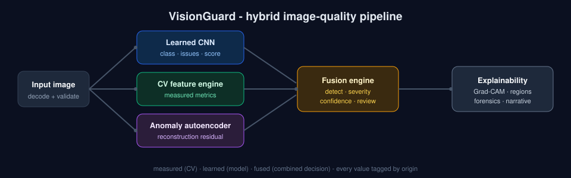

<div align="center">

# SANTHRA

**Visual Quality Intelligence**

*See the signal. Understand the evidence.*

`Upload  →  Analyze  →  Understand  →  Act`

</div>

Santhra inspects an image and answers six questions about it: **what** is wrong
(blur, exposure, noise, contrast, compression, colour, anomalies), **how severe**
it is, **how confident** it is, **where** the problem is, **why** it reached that
verdict, and **how reliable** the verdict is. It runs a learned CNN and a
classical computer-vision engine side by side and reconciles them in a
transparent fusion step, so every number is tagged by origin: **measured** (CV),
**learned** (model), or **fused** (a combined decision).

Runs fully local. No external AI services, no API keys.



## What a result looks like

Drop in a photo that looks acceptable at a glance. Santhra returns a verdict with
its reasoning, for example:

- A **quality score and band** (EXCELLENT / ACCEPTABLE / DEGRADED / POTENTIALLY_DEFECTIVE) with a confidence level.
- **Per-issue cards** that show the learned and measured signals side by side, e.g. `Blur HIGH` with **AI model 96%** but **CV signal 40%**.
- **Signal Agreement**: when the two detectors disagree it drops to LOW and **Review Recommended** fires, with the reason stated.
- **Where and why**: a Grad-CAM heatmap, CV problem regions, Quality Forensics (observed signal vs learned expectation), and a plain-language "Why did Santhra say this?".

Nothing is a black box: measured, learned, and fused values are always shown together.

## What is inside

| Layer | Stack |
|---|---|
| Frontend | React 18, Vite 6, TypeScript, Tailwind v4, Recharts |
| Backend | FastAPI, Pydantic v2, SQLAlchemy 2, SQLite |
| CV engine | OpenCV, NumPy, Pillow, scikit-image |
| ML | PyTorch, torchvision (MobileNetV3-Small, multi-task), scikit-learn |
| Deploy | Docker + Docker Compose (backend + nginx frontend) |

Hybrid architecture, training, evaluation and limits are documented in
[docs/architecture.md](docs/architecture.md), [docs/model.md](docs/model.md),
[docs/evaluation.md](docs/evaluation.md), [docs/api.md](docs/api.md),
[docs/constants.md](docs/constants.md) (why every threshold has the value it
does) and [docs/limitations.md](docs/limitations.md).

## Quick start (Docker)

```bash
docker compose up --build
```

- App: http://localhost:8080
- API docs: http://localhost:8000/docs

The trained model weights are committed under `ml/checkpoints/`, so the app is
fully functional immediately after build. No training step is required to run it.

## Quick start (local dev)

Two terminals.

**Backend** (Python 3.11+):

```bash
cd backend
pip install -r requirements.txt
python -m uvicorn app.main:app --host 127.0.0.1 --port 8000
```

**Frontend** (Node 20+):

```bash
cd frontend
npm install
npm run dev
```

Open the URL Vite prints (default http://localhost:5173). The dev server proxies
`/api`, `/media` and `/health` to the backend on port 8000, so there is no CORS
setup to do.

## Try it

Use the built-in sample buttons on the home page (Clean, Blurry, Underexposed,
Noisy, Mixed, Anomalous, ...) or drop your own image. Each analysis shows the
score gauge, per-issue cards with AI-vs-CV evidence, the image inspector (AI
heatmap and CV problem regions), the signal-agreement panel, quality forensics,
a plain-language "why" narrative, and the raw CV statistics. Results persist to
the History page; live model metadata is on the Model page.

Command-line smoke test:

```bash
curl -F "file=@frontend/public/samples/blurry.jpg" http://localhost:8000/api/v1/analyze
```

## Results (held-out test split, unseen sources)

| Metric | Value |
|---|---|
| Issue macro-F1 | 0.888 |
| Issue micro-F1 | 0.877 |
| Quality-class accuracy | 0.807 |
| Quality-score MAE | 10.27 / 100 |
| Class calibration ECE | 0.124 -> 0.022 (temperature scaling) |

Per-issue F1 spans 0.98 (blur, underexposure) to 0.71 (color_cast). Full tables,
confusion matrix and failure cases: [docs/evaluation.md](docs/evaluation.md).

## Tests

```bash
cd backend
python -m pytest -q
```

## Retraining (optional)

The committed weights are enough to run everything. To reproduce them from
scratch:

```bash
python ml/scripts/prepare_clean_images.py     # fetch clean source images
python ml/datasets/build_dataset.py           # source-first split + degradations
python ml/training/train.py                   # multi-task CNN
python ml/training/train_anomaly.py           # autoencoder
python ml/training/calibrate.py               # temperature scaling
python ml/evaluation/evaluate.py              # writes docs/evaluation.md
```

See [ml/README.md](ml/README.md) for details. The dataset build splits **source
images** before generating any variants, so no image leaks across splits.

## Data & licensing

**Training data:** [Imagenette](https://github.com/fastai/imagenette) (a fast.ai
subset of ImageNet), used for non-commercial research/educational purposes only
to synthesize a labelled quality dataset. It is downloaded at build time and
**not** redistributed here (`ml/data/` is git-ignored).

**Committed demo samples** (`frontend/public/samples/`, `sample_images/`) are
degraded versions of the freely-licensed photographs bundled with scikit-image
(astronaut and rocket: public domain; chelsea: CC0), so they are safe to
redistribute publicly. See [sample_images/ATTRIBUTION.md](sample_images/ATTRIBUTION.md).

Pretrained MobileNetV3-Small weights come from torchvision (BSD-3-Clause). All
degradations and labels are generated by this project's own code. See
[docs/model.md](docs/model.md#data-licensing--attribution).

## Project layout

```
santhra/
├── backend/      FastAPI app, CV engine, ML inference, fusion, DB, tests
├── frontend/     React + Vite dashboard
├── ml/           dataset build, training, evaluation, checkpoints
├── docs/         architecture, model card, evaluation, API, limitations
├── sample_images/ and frontend/public/samples/  demo images
└── docker-compose.yml
```

## Configuration

All tunables are environment variables with sane defaults (see `.env.example`).
Key ones: `SANTHRA_DEVICE` (`cpu`/`cuda`/auto), `DATABASE_URL`, `MODEL_PATH`,
`MAX_UPLOAD_SIZE_MB`, `CORS_ORIGINS`, `LOG_LEVEL`. Thresholds and versions live in
`backend/app/config.py`; there are no hardcoded machine-specific paths.
