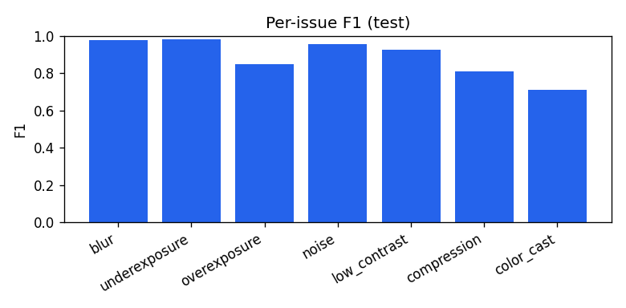
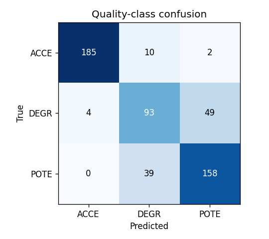

# Santhra - Evaluation Report

All numbers below are produced by `ml/evaluation/evaluate.py` on the **held-out TEST split** (540 variants from 180 source images never seen in training/validation). No metric is hand-written.

## Headline

- **Issue macro-F1:** 0.8881
- **Issue micro-F1:** 0.8767
- **Quality-class accuracy:** 0.8074
- **Quality-score MAE:** 10.274 / 100  (RMSE 15.255)

## Per-issue metrics (multi-label)

| Issue | Precision | Recall | F1 | ROC-AUC | Support |
|---|---|---|---|---|---|
| blur | 0.9658 | 0.9912 | 0.9784 | 0.9998 | 114 |
| underexposure | 0.9643 | 1.0 | 0.9818 | 0.9992 | 54 |
| overexposure | 0.8095 | 0.8947 | 0.85 | 0.9927 | 57 |
| noise | 0.9381 | 0.9725 | 0.955 | 0.9963 | 109 |
| low_contrast | 0.8926 | 0.9643 | 0.927 | 0.9935 | 112 |
| compression | 0.825 | 0.7984 | 0.8115 | 0.9533 | 124 |
| color_cast | 0.6282 | 0.8235 | 0.7127 | 0.9197 | 119 |

## Quality class

| Class | Precision | Recall | F1 | Support |
|---|---|---|---|---|
| ACCEPTABLE | 0.9788 | 0.9391 | 0.9585 | 197 |
| DEGRADED | 0.6549 | 0.637 | 0.6458 | 146 |
| POTENTIALLY_DEFECTIVE | 0.756 | 0.802 | 0.7783 | 197 |

Confusion matrix (rows = true, cols = predicted):

## Generalisation breakdown

| Subset | Count | Class acc | Issue macro-F1 | Score MAE |
|---|---|---|---|---|
| clean (0 issues) | 197 | 0.9391 | N/A | 5.111 |
| single (1) | 109 | 0.7431 | 0.8321 | 15.762 |
| mixed (2+) | 234 | 0.7265 | 0.9118 | 12.063 |

## Confidence calibration (temperature scaling, val-fit)

- Class NLL: 0.7193 -> **0.4281**
- Class ECE: 0.1238 -> **0.0217**

## Failure cases (largest score errors)

| id | true->pred class | true->pred score | true issues | pred issues |
|---|---|---|---|---|
| test_00495 | ACCE->DEGR | 100.0->40.20000076293945 | - | color_cast |
| test_00165 | ACCE->POTE | 100.0->45.79999923706055 | - | color_cast |
| test_00004 | DEGR->DEGR | 90.0->36.20000076293945 | overexposure | overexposure |
| test_00414 | ACCE->DEGR | 100.0->48.900001525878906 | - | color_cast |
| test_00452 | DEGR->POTE | 63.400001525878906->12.800000190734863 | blur, underexposure | blur, underexposure, color_cast |
| test_00060 | ACCE->POTE | 100.0->49.70000076293945 | - | noise, color_cast |
| test_00194 | DEGR->POTE | 85.0999984741211->40.0 | noise | noise, compression |
| test_00181 | DEGR->POTE | 78.9000015258789->34.099998474121094 | overexposure | overexposure, color_cast |

## Notes & limitations

- Trained on synthetic degradations of natural images; real-world
  degradations may differ (see docs/limitations.md).
- Under/over-exposure have smaller support (they share one recipe group);
  their metrics are noisier than the high-support issues.
- The anomaly autoencoder flags *potential* anomalies, not confirmed defects.